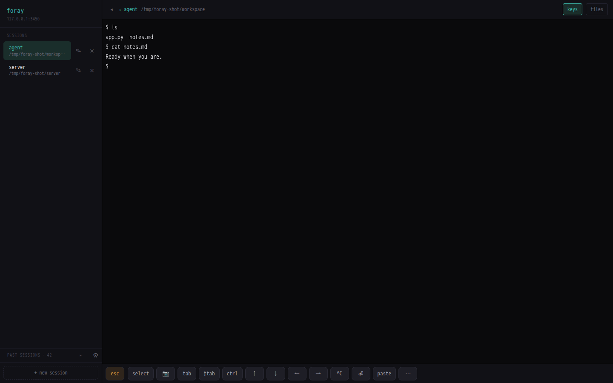
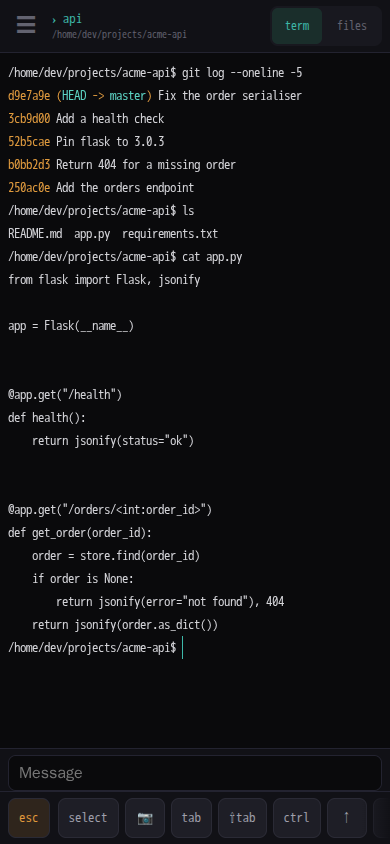

# Foray

A browser terminal that serves tmux sessions from your own box, built for
driving coding agents from your phone.





## What you get

- Your sessions run in tmux on your own server: close the tab, lose signal or
  pick up a different device, and they are still running, scrollback intact.
- A terminal you can actually drive from a phone — an input bar that leaves no
  IME ghost characters behind, and a toolbar for the keys a phone keyboard
  doesn't have: Esc, Ctrl, Tab, arrows.
- Past Claude Code sessions in the sidebar. Tap one to resume it, in the
  directory it ran in.
- A file tree and a Markdown editor beside the terminal, rooted at the
  session's working directory.
- Images from the camera roll, the clipboard or a drag: uploaded to the server
  and typed at the prompt as a path.
- Add to Home Screen and it opens like an app.

## Install

Foray runs on a server you control — a small Linux VPS or a Mac you leave on — and you reach it over [Tailscale](https://tailscale.com), so it is never exposed to the open internet.

1. Get a Linux VPS (Ubuntu 22.04+) or set aside a Mac to act as the server.
   A Mac needs [Homebrew](https://brew.sh), and a macOS recent enough that
   Homebrew still supports it — it ships prebuilt packages for roughly the
   last three releases, so macOS 15 (Sequoia) or newer; on an older one the
   install dies at the first dependency it tries to fetch.
2. Install Tailscale on it and sign in.
3. Run the installer on it:

   ```bash
   curl -fsSL https://foray-terminal.com/install.sh | bash
   ```

   It installs tmux, Node.js 24 and pm2, puts Foray in `~/foray`, deploys it,
   and prints your access token plus the `https://<name>.<tailnet>.ts.net`
   URL to reach it at. A fresh Ubuntu box needs nothing on it beforehand —
   not even Node.
4. Open that URL and paste in the token, once per device.

It has to be `| bash`. On most Linux boxes `sh` is a different shell
(dash), which would misread the script, so the installer checks and stops
rather than run under it. And as with any install one-liner: it is a shell
script that will run as you, so [read it](install.sh) before you pipe it
into a shell.

The site hands you the same file GitHub does — it fetches
`install.sh` from this repo's `main` and refuses to serve anything else, so
a bad fetch is a 502 rather than something your shell would run. To skip
the middleman, take it from GitHub directly:

```bash
curl -fsSL https://raw.githubusercontent.com/cushmachine/foray-terminal/main/install.sh | bash
```

## From source

For contributors, or anyone who would rather clone it themselves:

```bash
git clone https://github.com/cushmachine/foray-terminal.git ~/foray
cd ~/foray && bash install.sh
```

Both run the same `install.sh`, which installs tmux and Node 24, runs
`npm install`, and deploys Foray under pm2 — on the same Linux VPS or Mac
described above. Foray runs its own tmux server on its own socket, with its
own config (`scripts/foray.tmux.conf`) — it never writes or edits your
`~/.tmux.conf`, so it's safe to install alongside tmux sessions you already
run.

## Using it

**Sessions.** The sidebar lists them, and "new session" starts one in your home
directory. Each is a tmux session on the server, so closing the tab leaves it
running and reopening it brings the scrollback back. Rows rename and kill in
place (a kill asks twice). One device drives a session at a time: opening one
that another device has open takes it over.

**Past sessions.** The bottom of the sidebar lists the Claude Code sessions on
disk, newest first, with their title, directory and age. Tap one and Foray
starts a session in that directory and resumes it there. A session running
right now is marked `live` and can't be resumed — if it is running inside
Foray, the row jumps to it instead.

**Files.** The `files` button opens a tree rooted at the active session's
working directory, following `.gitignore` and skipping the noise
(`node_modules`, `dist`, caches), refreshed as things change on disk. Markdown
opens rendered; `edit` turns it into an editor, saved with the button or
`Cmd/Ctrl+S`. Other files open read-only. On a phone the tree replaces the
terminal; on a desktop it sits beside it and its edge drags to resize.

**The key toolbar.** Under the terminal: Esc, Tab, Shift-Tab, arrows (hold to
repeat), Ctrl-C, Enter, and `paste`. `ctrl` and `alt` are sticky — tap one and
it applies to the next key you press or character you type. `⋯` opens a second
row with Home/End, Page Up/Down, more control chords, and the punctuation
buried under a shift layer on iOS. `↑❯` appears when the scrollback holds one
of your prompts and jumps back to it. Desktop shows the toolbar by default;
the `keys` button in the top bar hides it.

**On a phone.** You type into the bar at the bottom rather than into the
terminal, and Enter sends the finished text as one paste; unsent text is kept
per session, so switching sessions doesn't lose it. Tapping the terminal
itself still types directly, which is what you want for a quick y/n. `select`
freezes the screen and scrollback as plain text you can long-press and copy,
then `Done` returns to the live terminal. (On a desktop, selecting with the
mouse copies as usual.) Swipe in from the left edge for the sidebar.

**Images.** Drop one on the terminal, paste one, or tap `📷` to pick from the
camera roll. Foray saves it under `~/uploads/` on the server and types that
path at the prompt, so you can write the rest of the sentence around it. PNG,
JPEG, GIF and WEBP.

**Keyboard shortcuts.** With a hardware keyboard, `Cmd+'` toggles the sidebar,
`Cmd+\` the file panel, and `Cmd+.` / `Cmd+Shift+.` cycle sessions. `Cmd+K` is
a leader key: press it, then `n` for a new session, `x` to close (again to
confirm), `r` to rename, `i` to insert an image. Keyboards without a Command
key use `Ctrl+Shift` with the same keys, and `Ctrl+Shift+,` to cycle back.

**Settings.** The gear in the sidebar sets the terminal's text size, for that
device only.

## Security

Foray is a shell on the machine it runs on: anyone holding the access token
has a shell as the user Foray runs as, so treat the token like an SSH key.
Every socket and file upload requires it. The app binds to `127.0.0.1` by
default and is meant to be reached through `tailscale serve` on your
tailnet, never exposed to the open internet directly. Read
[SECURITY.md](SECURITY.md) for the full picture — what protects you, what
does not, and how to harden a deployment — before you put this on a box
anyone else can reach.

## Token & updates

Both install paths leave you with a git checkout at `~/foray`, so both of
these run from there.

Print the access token again any time — a new device, or if you lost it:

```bash
cd ~/foray && npm run token
```

Update to the latest release:

```bash
cd ~/foray
git pull
npm install
npm run deploy
```

`git pull` will not quietly discard your work: if you have edited a file
the update also changes, it stops and names it rather than overwriting it.
`ecosystem.config.cjs` is the one you are most likely to have touched —
"Network and access" in [DEPLOY.md](DEPLOY.md) tells you to edit it for
`HOST`.

## Getting help

Open an issue on [GitHub](https://github.com/cushmachine/foray-terminal/issues).

## License

[GNU Affero General Public License v3.0](LICENSE) (`AGPL-3.0-only`).
